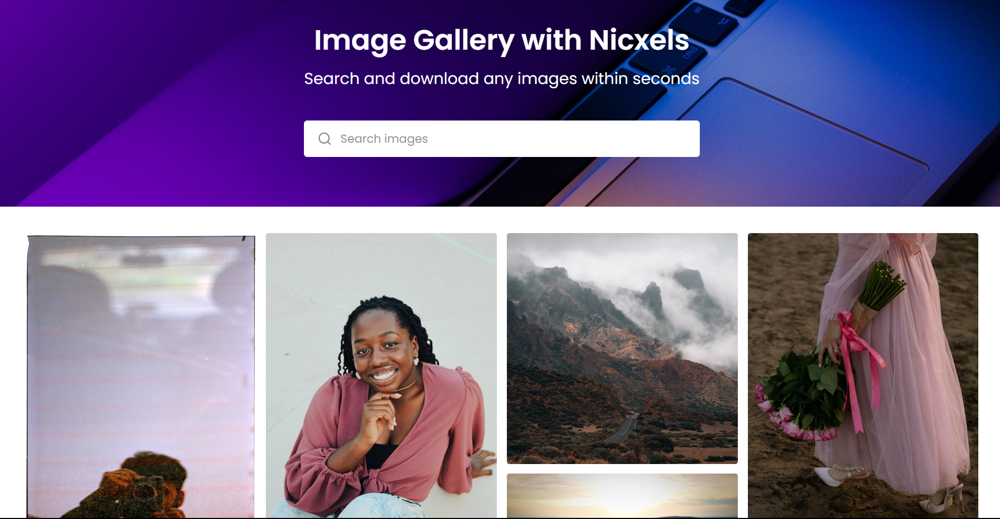

# Pixel Image Generator Website

This project is a simple website that utilizes the Pixels Free API to generate images. It is built using HTML, CSS, and JavaScript.


## Demo
[Link to live demo](https://nicxels.vercel.app)



## Features
- Generate images using Pixels Free API.
- Customizable parameters for image generation.

## Getting Started

### Prerequisites
- Web browser with JavaScript enabled
- Code editor (e.g., Visual Studio Code, Sublime Text)

### Clone the Repository
```bash
git clone https://github.com/swapnil-tayal/Nicxels.git
